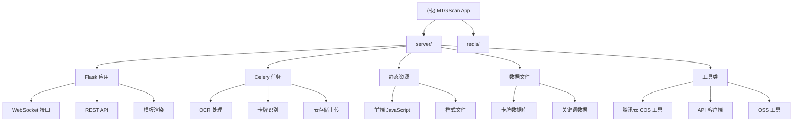

# MTGScan App - 项目架构文档

## 项目愿景
MTGScan App 是一个基于 Web 的应用程序，用于识别图像中的万智牌卡牌并生成牌表。该项目结合了 Azure 计算机视觉 OCR、Flask Web 框架、Celery 任务队列和 Socket.IO 实时通信技术。

## 架构总览



## 模块索引

| 模块路径 | 语言 | 主要职责 | 入口文件 | 测试状态 |
|---------|------|----------|----------|----------|
| `server/` | Python | Web 服务器和任务处理 | `app.py` | 无测试 |
| `redis/` | Config | Redis 配置和部署 | `redis.conf` | 无测试 |

## 运行与开发

### 环境要求
- Docker Compose
- Azure 计算机视觉凭证
- Python 3.10+
- Poetry 包管理

### 快速启动
1. 配置 Redis 密码文件
2. 配置 Azure 环境变量
3. 运行 `make up`
4. 访问 http://localhost

### 开发命令
```bash
# 启动开发服务器
cd server && poetry run python app.py

# 启动 Celery worker
cd server && poetry run celery -A app.celery worker -P eventlet --loglevel=info

# 使用 Gunicorn 生产部署
cd server && poetry run gunicorn -w 8 -k eventlet --timeout 120 -b 0.0.0.0:5002 app:app
```

## 测试策略

当前项目缺乏自动化测试覆盖。建议添加：
- 单元测试：API 端点、OCR 处理逻辑
- 集成测试：完整的图像识别流程
- 端到端测试：用户界面交互

## 编码规范

- **Python**: 遵循 PEP 8 规范
- **JavaScript**: 使用现代 ES6+ 语法
- **配置**: 使用环境变量管理敏感信息
- **错误处理**: 完善的日志记录和异常处理

## AI 使用指引

本项目适合使用 AI 协助以下任务：
- 代码重构和优化
- 测试用例生成
- 文档编写和维护
- 性能调优建议
- 新功能开发指导

## 变更记录 (Changelog)

### 2025-08-23 - 架构文档初始化
- 创建根级 CLAUDE.md 文档
- 添加项目架构总览和模块结构图
- 记录当前项目状态和测试缺口

### 近期提交记录
- f6a9d0c: refactor(data): 更新 all_cards.txt 中的卡牌数据
- 9c7c683: feat: 添加大量新卡牌数据到 all_cards.txt 文件
- fe0915a: feat: 添加大量最终幻想系列卡牌数据到 all_cards.txt
- acc784b: build: 将 qcloud-cos 替换为 cos-python-sdk-v5
- 3bc8751: feat(server): 添加腾讯云COS支持并替换OSS工具类